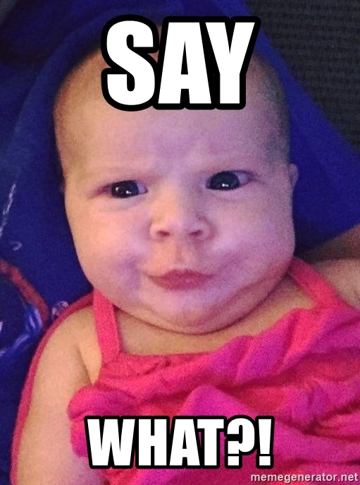
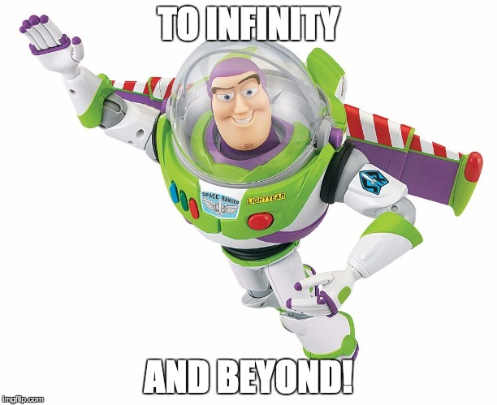

I watched <a href="http://www.imdb.com/title/tt0338013/" target="_blank" rel="noopener">Eternal Sunshine of the Spotless Mind</a> a few days back and man it was amazing.

The story. The flawed characters. The dialogue between the characters. Everything.

Take the quote below for example:

> Does that make you sad or anxious?
> I mean, I am always anxious thinking that I am not living my life to the fullest. You know, taking
> advantage of every possibility, making sure I am not wasting one second of the little time I have.
>
> Clementine

Can you relate to that?

Knowing deep down that the clock is ticking and every second that slips by is one less second left for you to get to where you want to.

For your pursuit of happiness.

For you to start living a richer life.

To start a business of your own.

Or a blog.

To spend time with your other half.

To spend time with your friends.

To become successful.

To become *happy*.

To achieve everything you ever wanted to.

I can relate to that.

And the closest that I can come to describing that feeling is - "panicky".

Generally that would be it. I would think about it. Shudder at the thought of it and then go binge watch Mad Men on Netflix.

But the day I watched the movie, I thought about it.

I thought about it more than I usually think about it.

I thought about why it is that we feel that way.

## Because of scarcity. That's why.

Assuming you and I are average people, we have roughly 50 years or 1.5 billion seconds (Thank you Google!) to make things happen for us.

Yet, it feels like nothing.

Why is that?

Why does so much time seem to fly by in the blink of an eye?

The answer is simple.

Scarcity.

Having a limited amount of time, with an unlimited amount of "things" to do.

Tasks to take care of.

Errands to run.

Chores to do.

Projects to complete.

It is because we are buried so deep under this mountain of seemingly necessary and important things we *have to* do, we forget about the things that we _want to_ do.

Things that make us feel happy.

Things that feel like they are worth every second we spend on them.

In an ideal world, we would never have to waste time on anything meaningless.

Yet, ours is not an ideal world.

Whether you are a hotshot CEO of some billion dollar company or a little kid in high school, chances are that there are things you absolutely need to get done, no matter how meaningless they are (and whether you want to do them or not).

These things are the time-sucking black holes that eat up those precious seconds you are so scared of wasting.

Yet, there is a way out.

Yes, there are things we must do to survive. But that doesn't mean we need to spend all of our waking moments on them.

Because while they absolutely need to get done.

They don't have to be done by you.

## Say no to make the most of your time

In recent times, saying no as productivity advice has become all the rage (and with good reason).

Being bombarded with information, opportunities and things that we must do from all sides, shutting it all out seems to be the only way of preserving our sanity.

Yet, depending on where you are in your life and what you say no to, you could easily end up like Jim Carrey from Yes Man.

`video: https://www.youtube.com/watch?v=d15qaCNGxpY`

And that isn't a very nice place to be at.

What we need is to be able to strike a balance.

A balance between having no as our default answer to everything that comes our way vs being open for life-changing opportunities.

So is there a way clear cut way of doing that?

Short answer - no.

Long answer - still no BUT there is a rule of thumb that you can follow to deflect majority of the "time drainers" _before_ you even take them on.

Here is the rule:

> Only say yes to things that benefit you (in a relevant way) and that you can make time for. <strong><a href="http://ctt.ec/adOfe" target="_blank" rel="noopener">[Tweet this]</a></strong>

Because as a wise man once said, prevention is better than the cure.

The less "busy work" we take on, the more time we have left to do the things that really count.

## A job offer from a drunk friend

Let me give you an example.

It was the night of my graduation dinner.

I was just being cool sipping on my drink when this friend of mine came up to me.

It was obvious that he was drunk. Possibly, _very_ drunk.

He came in real close and said "Yo.. bro are you looking for a job?"

After saying no to him, only to have him come back and ask me the exact same question two more times, I realised that he wasn't kidding.

Now at this stage, I was happily working for the company that I was interning for and had every intention of going to work full time for them.

Given that I really liked the people that I was working with and having settled into the team quite nicely, I could have easily said no.

Yet, at that stage in my career, being open to opportunities was more important than staying in my comfort zone and playing it safe.

So, I decided to apply the rule of thumb by asking myself two simple questions.

If I say yes to this, will it benefit me in any way?

Duh.

A better job would be awesome and a chance to work with (and learn from) people that had decades of experience on me would make it ultra awesome.

Plus who knew, I might even be able to get paid more!

Second question - Do I have or can I make time for this?

Once again, yes.

All I had to do was to simply message this friend of mine to set up a meeting. The meeting would take up roughly an hour and that would give me the information I would need to decide whether to take this further or not.

It was quite simple. The amount of time I could lose vs the potential gain made this an awesome opportunity.

So I sent that message, met up with the directors of LeapThought and 3 years (plus a lot of lessons learnt) later, here I am thanking my stars for having made that decision.

## Do you want to build an app?

I got one more example for you.

Last year, I had a friend come to me with an app idea that he and his brother were quite keen to work on.

They had done their research. They spotted a gap in the market and were ready to rumble.

Then, they approached me to work on it.

It sounded like an awesome opportunity. A chance to work with some seriously experienced mates on an app that had already been validated. A chance to do something of my own where I would be one of the co-founders and would have a say in the direction we go.

Surely this was too good to say no to.

Yeah yeah.

By this time though the rule of thumb had become second nature for me.

So, without even realising it, I used it.

If I say yes to this, will it benefit me in any way?

Well of course it would, my mind said.

But then I rephrased the question:

If I say yes to this, will it benefit me in a way _that is relevant_?

All of a sudden, I found myself answering _maybe_.

Simply because I wasn't sure if building an app was what I wanted to do. If it was aligned with where I saw myself going.

Second question - do I have or can I make time for this?

Well, I was pretty busy trying to take on bigger and better things at work while simultaneously working on a web design agency of my own with a friend.

So time was a bit short. Which meant the answer was a "probably not".

Based on these two answers (maybe and probably not), I decided to not go for it.

## The two phases that we all go through (repeatedly)

That was pretty straightforward.

But, imagine if I had just gotten fired from my job or if the app that they were talking about building was sure to be the next Google or Facebook.

What would I have done? In fact, what would you have done?

Grabbed the opportunity with both hands (and legs) and hung on to it for dear life! That's what!

Yet, anything less would not have been enough to get us to commit.

This is interesting because it highlights that throughout our life (without even realising it), we go through phases where we can easily let most things go by (except for the blindingly obvious opportunities) vs phases where we *have to* capitalise on even the half chances that come our way (aka desperation mode).

Since I was in a phase of my life where I knew my goals (to grow as a software engineer and make some money on the side), I could let most opportunities (except for the ultra awesome ones) pass by without even casting a second glance at them.

Whereas, had things been different. Had I been feeling stuck at work (or just getting too comfortable), keeping my eyes and ears open and looking into everything and anything that came my way would have been the best way forward.

In fact, in that scenario actively seeking out opportunities and being ruthless in replacing whatever was on my plate with anything better would be the ideal course of action.

In the former scenario, I would have had "No" as my default answer meaning that unless the answer to both my questions was a "Yes", I would pass up on whatever I was considering.

Whereas in the latter scenario, I would have had "Yes" as my default answer and taken up anything as long as the answers to one of the questions wasn't a definitive "No".

Understanding what phase of your life you are in and having a default mode based on that is the most optimum way of handling your day to day tasks (without getting bogged down) while keeping you open for the important things in life.

## Rule of thumb for a reason

As a final tip, remember that this is a "rule of thumb" a.k.a. not something set in stone.

When things are looking marginal, _always_ back yourself.

This means that if you apply this rule and are still unsure about what to do, do what your gut says.

If it says yes then say yes, if it says no then say no because we live in a complex world where things are never quite black and white.

Yet within these shades of grey, using techniques like this can help us ensure we don't spend too much time making decisions that could be made almost instantly by answering two simple questions.

To make the most of this, apply it as often as you can till it becomes second nature.

When all is said and done, our aim should be to minimise the things that we _have to do_ while maximising the things that we *want to do*.

Things that make us happy.

Things that make our lives worth living.

Whether that is spending time with our loved ones, sleeping in or going for long drives.

It's a pretty simple equation.
