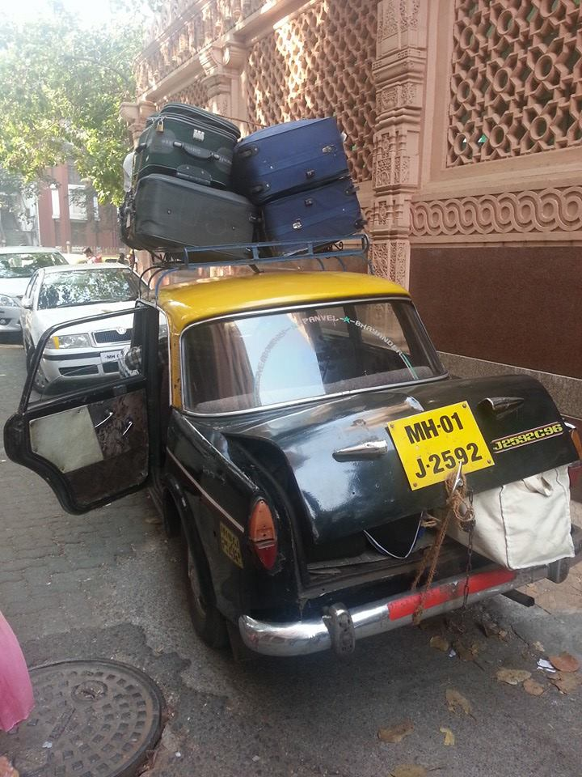
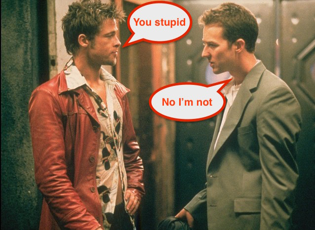
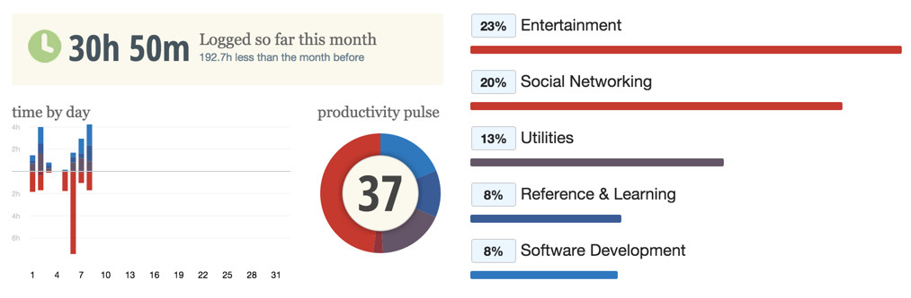

Travelling - especially Indian style - is never easy.

Carrying around half of your house, in bags of various shapes and sizes isn't just the norm.

It's a tradition!

Going back to India? Gotta carry 5 kgs of chocolates for all the cousins and uncles and aunties and neighbors.

Going outside of India? Gotta take some of the yummy food!

Buy 6 packs of this and 10 packs of that and 12 packs of this stuff as well.

On a road trip with friends? Gotta have 6 jumpers.

Just in case it starts snowing.

Randomly.

In the middle of summer.

While I love the thought of travelling, I hate packing for it!

I hate it because it forces me to show favouritism for my clothes.

That moment, when you have almost got your suitcase packed up.

By jumping up and down on it.

Only to realise, you forgot to put in your favourite pair of Wonder Woman socks.

That is when you know, the struggle is real.

## Life = Overcrowded suitcase

Come to think of it though, our lives are like that suitcase as well.

Just like the suitcase has limited space, you have a limited and finite amount of time (and energy) to give to the business idea that you are thinking of starting or the guitar you are thinking of learning.

While we try to pack in as much of the good stuff as we can, it can be very easy for our "suitcase of life" to become chock-a-block  with random time wasters that can sneak their way in.

And, that is precisely why knowing how to <a href="http://www.thecodetoawesome.com/how-to-make-the-most-of-every-second-you-got/" target="_blank" rel="noopener">say no to things</a> that don't benefit us or are not relevant, is so essential.

(Btw, doing so can also free you up for accepting <a href="http://www.thecodetoawesome.com/how-to-make-the-most-of-every-second-you-got/#job-offer" target="_blank" rel="noopener">drunk job offers</a>!)

Yet, even if you are guarding the sanctity of your "suitcase" with your life.

Making sure that anything that isn't useful doesn't even get close to it.

It still doesn't guarantee there aren't things - useless things - already in there, that are just not worth the space/time/energy they are taking up.

Things that you do everyday.

Most times without even realising the amount of precious time and energy that they end up chewing through.

Time and energy that you could put towards doing things that make you happy.

(Seeing/liking engagement and baby photos rarely makes anyone happy.)

So what can you do about these "space-takers"?

Well well well.. you are in luck.

Because while _I_ had to turn my suitcase upside down to find space for my favourite socks, a much simpler solution exists for you.

## If you can't measure it, you can't improve it

What would you say someone is doing, if they blindly keep investing their money without giving a single thought to the return on that investment?

They are...

A. Shooting arrows in the dark?

B. Taking a punt?

C. Being stupid?

D. All of the above.

High five! (if you went with option D)

Yet.. if you think about it, this is exactly what most of us do with our time.

How many times have you said to yourself "I don't even know where all my time went today.."?

Keeping track of your time will show you _exactly_ where it went.

So that you can then recover it and put it to use on things that make a difference.

Meaningful things.

Don't believe me?

I didn't believe my alternate self, telling me that I was being stupid and wasting my time without realising it, either.

So I decided to run an experiment. I decided to measure where I was spending my time.

At first, I was going to keep a time log of everything I did (old school pen and paper style) but then luckily, I stumbled upon <a href="https://www.rescuetime.com/" target="_blank" rel="noopener">RescueTime</a>.

---

_**Note:** I am not affiliated with RescueTime nor am I getting paid/compensated for this in any way (unfortunately)._

---

Fast forward a week or so and below is what I found:

43% of my time was spent on Entertainment and Social Networking!

This means that on average I spent almost _half of my time on a computer_ reading people's statuses, liking their selfies and watching <a href="https://www.youtube.com/watch?v=9h5mwoTwDBk" target="_blank" rel="noopener">babies taste lemon for the first time</a> on YouTube!

I always knew Facebook and YouTube were a time drain, but I also thought that other lesser and weaker minded people were the ones susceptible to the charms of these sites.

Not me.

I am better.

And awesome-er.

And more good looking too.

Well, not quite I guess ☹️

To make things worse, what did I have to show for half of my week that was spent on Facebook and YouTube?

A big fat nothing!

In other words, the return on investment was ZERO!

Yet, I would have never come to this realisation if I hadn't bothered measuring where I was spending my time.

I know it's not as sexy as suddenly waking up one day and taking a pill to make your brain work at 125% of it's capacity (a.k.a. Limitless style) but if you can measure how you spend your time, you can improve how you spend our time.

And best of all, once you know what your worst undercover time wasters are, you can take steps towards fixing them and actually see a difference when your efforts result in an improvement!

## Make space for your (proverbial) favourite pair of socks

So instead of just nodding along with me (and then secretly laughing at me for owning a pair of Wonder Woman socks), let's go over how you can do this for yourself.

It's actually quite simple.

1.  Download RescueTime from <a href="https://www.rescuetime.com/download" target="_blank" rel="noopener">here</a>. It's **free**.
2.  Set it up (takes literally 2 minutes).
3.  Let it run in the background for a week (or a couple of weeks).
4.  Receive an email in your inbox at the end of the week, showing you exactly where you spent your time (down to the exact websites/programs that you frequented)!

My worst offenders were YouTube, VLC Media Player and Facebook!

Let me know in the comments below where you ended up spending most of your time! (and also if you have any trouble setting up RescueTime)

**P.S.** Regardless of whether you use RescueTime or not, I urge you to note down where you are spending your time as I can guarantee that you will be surprised at what you uncover!
