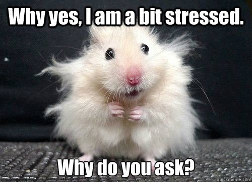
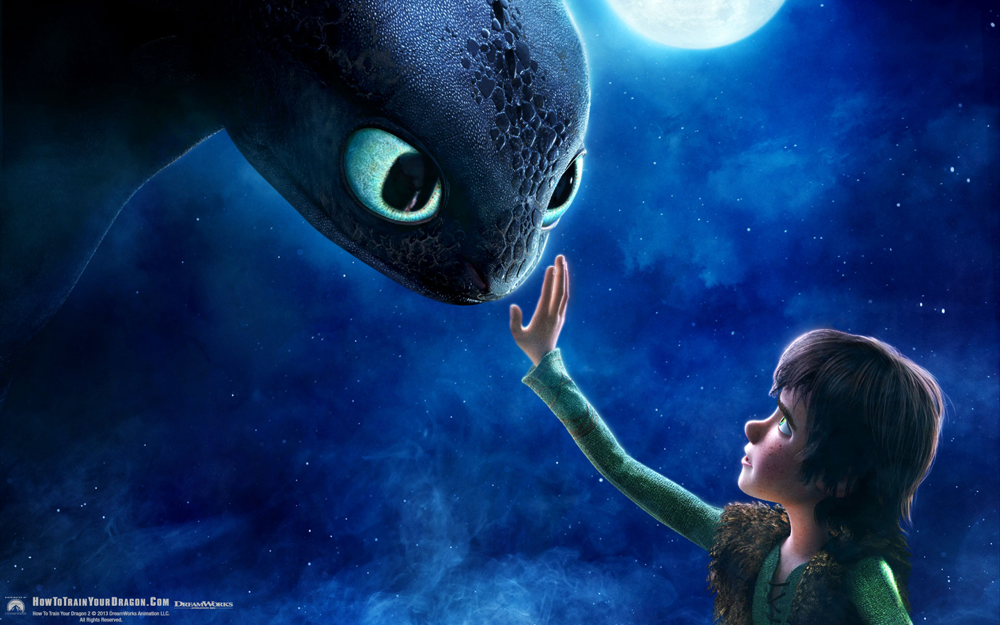

Stress stress stress stress stress stress stress. *Streeeesssssssssssss*.

Just saying that word more than once and stressing on it stresses me out!

Growing up, we are taught that stress is the enemy. I mean no one actually says it out loud like that but it's kinda obvious.

As kids when we saw our parents looking worried and anxious, we heard them say "I am so stressed".

Most of us have seen or heard of *someone* having a full blown meltdown that got attributed to stress too.

When your partner or friend is in an irritable mood, he or she would often say "Sorry, I am just really stressed".

In the news, we see statistics that show how stress is one of the leading causes of deaths worldwide.

So while no one explicitly tells us that stress is bad, any sane person with a little bit of common sense can come to that conclusion by themselves, looking at everything that goes wrong around us - apparently because of stress.

Stress is bad. Stress is evil. Stress should go die.

But pause here for a second.

What if I told you that it doesn't have to be this way?

What if you can make it so that you actually _look forward to stressful situations_?

Instead of being days worth forgetting, what if your most stressful days became some of your best days?

The pounding heart, fast paced breathing, sweaty palms and butterflies in your stomach - instead of making you feel jittery and anxious, what if they were signs that your body was preparing you for the challenge ahead?

Can stress really make your body "hulk up" to rise to the challenges you are about to encounter?

Are all of those things really possible?

Well, from personal experience _and_ according to science, yes. Yes they are.

## The New Science of Stress

Dr. Kelly McGonigal (in addition to being a very pretty lady with beautiful eyes) is a world famous health psychologist and author of the book Upside of Stress. For years, she practiced and preached the mantra that stress is the enemy.

Then one day, her world fell apart.

She came across a very interesting study that suggested what she had believed in and more importantly, what she was teaching her patients all this time, was wrong.

In her own words:

> This study tracked 30,000 adults in the United States for eight years, and they started by asking
> people, "How much stress have you experienced in the last year?"
> They also asked, "Do you believe that stress is harmful for your health?"
> And then they used public death records to find out who died.

Wow. Go science.

Here is the interesting bit though. Results of the study showed that people who experienced a lot of stress, had a 43% chance of dying in the next year. _However_, that statistic was only true for the people who perceived stress as harmful.

Now hold it right there. And read that again.

The results showed, people who experienced severe stress and thought that it was harmful for them were the ones most likely to die. And people who thought otherwise were actually less likely to die compared to even people who had relatively little stress!

That's totally off the chain, isn't it?

As if that wasn't a clear enough indication of the fact that our traditional demonising of stress is misplaced, McGonigal herself conducted another study.

> I went to 121 countries and asked people the same question that I asked you, did you experience a
> great deal of stress yesterday? And then they computed something called a stress index, and
> that’s the percentage of people, in any country, that said yes, yesterday was very stressful.

10 years later, another group of researchers took the same dataset and asked an interesting question with an even more interesting result:

> Does a country’s stress index correlate to other indices of wellbeing, like life expectancy, GDP,
> the global happiness, or the satisfaction with people’s lives? And it turns out that it does. But
> in exactly the opposite direction the researchers expected.

Whaaaaaaaat?

Turns out,  if stress isn't perceived as harmful, then it's probably not. On top of that, if you actually perceive it as a positive "thing", chances are you will end up better off than most other people with relatively less stress.

So, how exactly can we take advantage of these findings?

Well, in Dr. McGonigal's words:

> When you change your mind about stress, you can change your body's response to stress.

## Beating Stress

Stress is like the dragons from How To Train Your Dragon.

In that movie, Vikings spend the first half trying to kill them all, only to realise in the second half that HOLY SHIT they need the dragons help to get rid of the super humongous mama dragon hell bent on roasting everyone!

Stress can definitely be dangerous. And just like the dragons it can kill you as well.

But that is only if it is _mistreated_ as something harmful instead of being understood and handled correctly.

Because lets face it, if you want an exciting, adventurous life where you achieve your goals and be successful and happy, you will need to take risks and work hard and put your self out there. In those scenarios, being stressed from time to time will be inevitable.

Yet, how you handle that stress and not just beat it, but actually use it to your advantage is the difference between being awesome vs being ordinary.

An ordinary person would panic and get more stressed because they are stressing about being stressed. But you will welcome it with open arms instead. Knowing that this is your body raring to jump head first in to the hard work ahead.

And, the more you do this, the easier it will get. Till you get to a point where you will start enjoying it. You will look forward to situations where the pressure is on and while everyone else starts to falter around you, you will get stronger and be the one to carry yourself and your team through.

And that there, is a feeling worth striving for.

So next time you are feeling stressed, take a deep breath. And remember that if you embrace the stress, it won't cause a mess.

## Long Story Short

Whether it's due to the media, the people around us or just our own bad experiences, stress has always been thought of as a negative feeling. And while it can be bad for you, here is what you can do to avoid that from happening and use it to propel you forward instead:

- Make stress your friend. Perceive it as a positive feeling and your body will do the same.
- Do it often enough to turn it into a habit. This will make you stand out as the person who can deliver when it matters.
- Finally, you are at risk from stress only if you stress about being stressed. So don't!

In case you were wondering, this post was inspired by the following awesome 15 minute talk!

`video: https://www.youtube.com/watch?v=RcGyVTAoXEU`

<strong>If you found this to be useful (or entertaining), then please do share it around using the buttons below!</strong>

