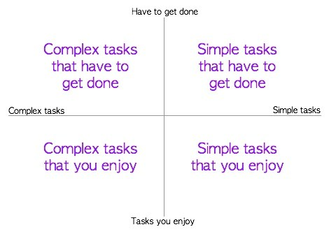

Last week I went on a ski trip for my brother's birthday.

I was planning on owning the ski fields and making them my bitch. But turns out skiing is pretty hard...

Especially, skiing in the beginners area full of people and potholes.

There were times when I managed to pull off a couple of sweet moves (a.k.a. not fall flat on my ass before skiing more than 10 metres) but almost always things ended in one of two ways.

Either, I would get stuck in a pothole, flip over and fall like a stuntman in a bad 90's action movie. Or, I would be forced to sacrifice myself while trying to prevent innocent bystanders from being run over (by me).

After 4 hours of relentless sliding around on my ass, I realised that my skiing was just like my productivity. Very rarely consistent and mostly made up of starts and stops interspersed by spectacular crashes.

In one word, it was _fitful_.

## Why Fitful Productivity Sucks

We are all productive from time to time. Yet, as we have all experienced, being productive every once in a while just doesn't cut the mustard.

At best, you manage to scrape through and get a few little bits and pieces done.

But at worst, you can't get anything significant done because as soon as you start getting into your groove, you decide that you deserve to take a break or you get distracted. And with that one decision, the rest of your day goes down the gutter.

In skiing terms, it's like picking up speed going down a slope, feeling the wind in your face and feeling like you own the hills. Only to hit a valley that ruins all your momentum and forces you to walk up to the top of the next hill to start alllllll over again.

In addition to being heartbreaking, annoying and frustrating, this is also a waste of precious energy and time as you keep trying to convince yourself to start again while feeling guilty as hell about having abandoned things just when you seemed to be making progress.

It's like going to your favourite Mexican restaurant only to leave after having just one bite of your favourite food. And then having to convince yourself to go back and finish off the cold nachos with solidified cheese all over them.

So the million dollar question is how can you avoid all this heartbreak and wasting of your super precious time and energy?

## Taking Advantage Of The Slippery Slope

> slippery slope - a course of action likely to lead to something bad or disastrous.

In other words, slippery slope is an endless, inescapable shit slide that drags you down deeper into the depths of despair.

When put that way, it sounds terrifying. But let's see why it is perfectly placed to be an awesome anti-fitful productivity tool.

On one hand, a slippery slope works because it puts people in a set of circumstances where they are *unable to stop* doing things that make their situation go from okay to bad to worse.

On the other hand, the root cause for fitful productivity is that for whatever reason we _end up stopping_ while making good progress and being productive.

Are you thinking what I am thinking..?

On a given day, if we can arrange our tasks in a "slippery slope", chances are that we will just keep on sliding down that slope and finish off everything without having to start and stop and start and stop (again) or feel guilty about not having done what we planned to do!

To put this into action, start by making a list of things you need to do.

From these, identify the things that you would enjoy doing vs the things that you just have to get done.

Then identify things that are relatively complex and will require a lot of work vs things that are trivial and can be taken care of quickly.

</img>

Now with your tasks divided up in four categories, simply arrange them in a list that has the most complex tasks that need to get done alternating with simpler or more enjoyable tasks.

The idea here is to keep your energy and motivation up throughout the day by alternating between tougher tasks followed by easier or more enjoyable tasks that give you a break (_while you are still getting work done_). Thus ensuring that you keep checking off these tasks without getting distracted or running into a "mental wall".

For example, my slippery slope list from the weekend started off with me writing this post (a complex but enjoyable task), followed by mowing the lawn (a simple and enjoyable task - don't judge). Then, I spent an hour looking into an issue at work that I just couldn't make time for during the week (a complex task that needed to get done) followed by finishing off my day with a dance practice (another simple and enjoyable task).

Going at my tasks in this fashion instead of trying to write this post at the end of the day (when I had no energy left), allowed me to keep getting things done while never really feeling exhausted or feeling like I needed a break.

This approach can work regardless of whether your task list has 2 tasks or 20. The key is to experiment with it and tweak it to suit your preferred style of working. For instance you might find it better to start off your day with the toughest tasks and do smaller things towards the end of the day. Or, you might warm up a little bit at the start of the day by taking care of the little things before rolling up your sleeves to tackle your "big fish" for the day.

Taking advantage of this technique will make a world of difference to your productivity and will allow you to smoothly slide through your to-do list instead of having to force yourself through it.

 Just like this guy.

## Long Story Short

Being productive every once in a while is easy but consistent productivity is the key to getting shit done.

So in order to avoid fitful productivity (by taking advantage of the slippery slope technique):

- Plan out your day by making a list of tasks.
- Divide them up into four categories based on how complex vs how enjoyable they are.
- Based on these categories, arrange tasks in a way that allows you to manage your energy levels by getting things done _while_ having a break as part of some of the more enjoyable/simpler tasks.

<strong>As always, if you can relate to this and found it to be useful, please share it around to ensure that no one else has to suffer through the heartbreak of fitful productivity like we have!</strong>

