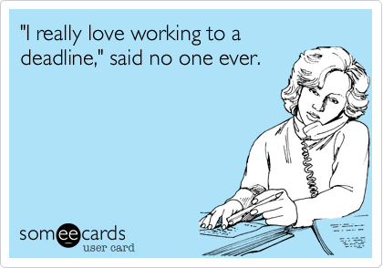
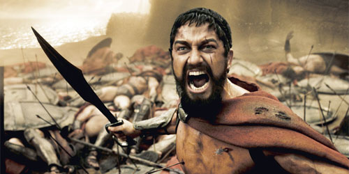
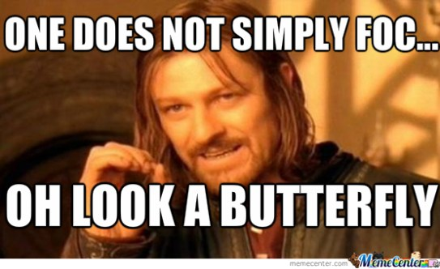
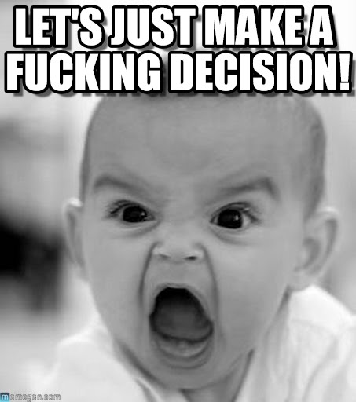
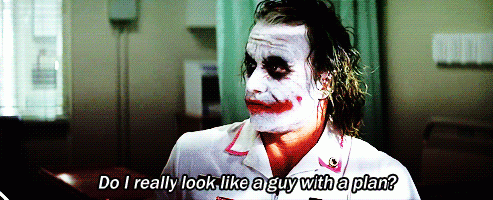
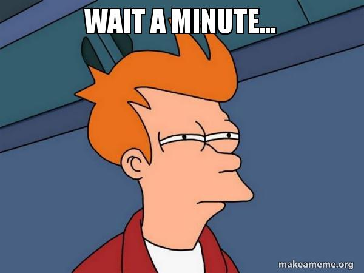

Everyone hates deadlines.

At their worst, deadlines are the bane of our existence that keep us up at nights, kill our weekend buzz and become the single biggest source of unhappiness in our lives.

However, here are seven - not one, not two, not three but _seven_ - reasons why deadlines can actually be pretty awesome!

### 1. Deadlines are an awesome motivator.

Where nothing else seems to be able to motivate you to get off your ass and get stuff done, a deadline will do the trick!

Having a deadline for a task is like having an angry drill sergeant constantly yelling in your ear what he will do to you if you don't do the thing that you are supposed to do.

It addition to that, it also helps to have something to work towards instead of just wandering around aimlessly doing a bit of this and bit of that.

### 2. Deadlines make things exciting!

Spicing things up is a specialty of deadlines.

Gamifying your life where you are working against the clock to be over and done with all of your boring tasks can be an awesome way of getting work done while keeping yourself from getting bored.

Things like mowing the lawn and doing the dishes are a perfect fit for this sort of thing.

### 3. Deadlines force us to focus.

Instead of worrying about laundry that needs to be done this weekend, a looming deadline will _make you_ focus on that report due tomorrow morning (which is probably more important).

Also, when struggling to deal with issues in your personal or professional life, working against a deadline can help (force you to) take your mind off of those issues and focus your time and energy where they are actually useful.

### 4. Deadlines force us to make decisions.

When would it be easier to do a bungee jump? When they tell you to take your time or when they tell you, jump in 5 seconds or you lose your money?

If someone tells you to get a blog up and running by the end of the day, you will have a lot more chance of succeeding than you would by giving yourself three months to set it up (where you will probably end up spending 2 months, 3 weeks and 6 days on selecting the "perfect" theme).

### 5. Deadlines make you plan and prioritize.

For the Joker types amongst us, having to deal with multiple deadlines will force you to plan and prioritize.

This in turn will give you an opportunity to identify <a href="http://www.thecodetoawesome.com/how-to-work-smarter-by-going-for-the-big-wins/" target="_blank">smarter ways of working</a> and also give you a valid reason for putting off some of the less essential (and more boring) things.

### 6. Deadlines limit how much work you can do.

At first, that sounds bad.

Yet, knowing that you have a limited amount of time to do what you can, will make you work harder and faster thus making better use of your time. It will also make you feel a lot more happy/relieved once you are done.

### 7. Finally, deadlines can make you feel awesome.

While deadlines do result in more stress, finishing off something within a tight deadline while <a href="http://www.thecodetoawesome.com/how-to-beat-the-st-out-of-stress-according-to-science/" target="_blank">beating back the stress</a> will show you how awesome you truly are and make the thing that you completed that much more meaningful.

<strong>Know someone with deadline-o-phobia? Share this with them!</strong>

