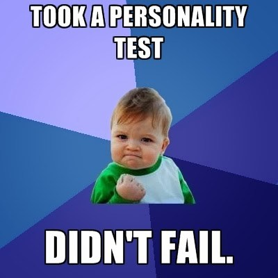
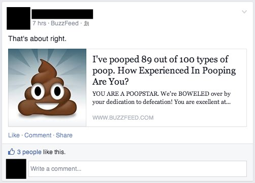
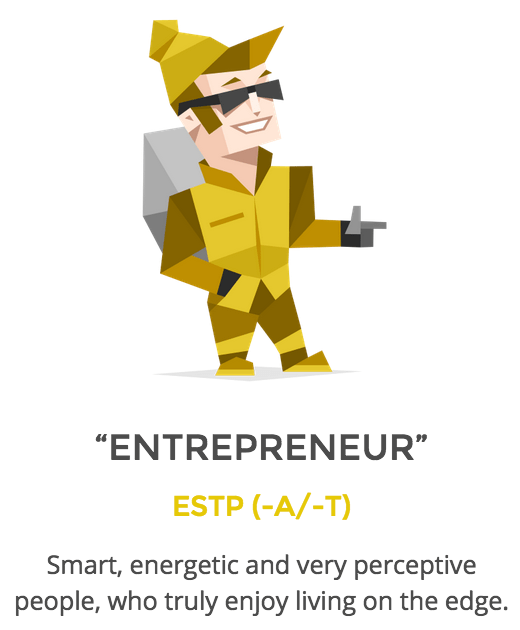
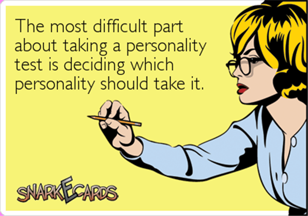

We all want to move forward in life. Whether it be for our career or relationships, we want to do what is best for us and people around us.

An integral part of this process of "moving forward" is understanding where we currently stand. In the context of self-development, this means we need to figure out and understand our deepest fears, hopes, dreams and aspirations. To understand what motivates us. What demotivates us.

As with anything else, there are multiple ways of doing so. You could (creepily) observe yourself while doing things and see how you react in different situations. Or you could _think_ about how you would react in different situations and then try to gain an understanding of yourself from that. However, doing so can be quite challenging and time-consuming and being a (lazy) software engineer, I am always looking for an easier and simpler way of doing things.

That is where personality tests come into the picture.

## The Easiest Way To Know Yourself

For the uninitiated amongst us, personality tests are - as the name suggests - tests that give you insights about your personality. A bunch of questions that depending on the way you answer them, tell you what you are *really* like.

Kind of like those Facebook quizzes that really took over a little while back.

I took the Myers Briggs personality test (free link at the bottom) last week and what it revealed about me was fascinating. Technically, because it just told me things about my own personality, none of it should have come as a surprise. However, the fascinating aspect was how well it articulated some of my most common traits that I didn't even know existed.

>

For example, my personality type turned out to be ESTP - Extroverted Sensory Thinking Perceiving type. While most of the things I read about myself were pretty awesome, my "profile" did point out that when it comes to dealing with theoretical or abstract concepts, I tend to zone out. Armed with this knowledge, next time I try to learn something theoretical, I will attempt to link it to a concrete/practical example to ensure I understand and retain the theoretical/abstract aspects of the concept (in my own way).

Another flaw of my type is that, apparently, we can be quite insensitive at times by opting for logic/reasoning over feelings. This can obviously be detrimental for me when dealing with people in stressful situations. However, now that I know about it, I can ensure that in such situations I attempt to  understand where the other person is coming from, thus minimising any sort of disconnect that might occur due to my insensitiveness.

In addition to being very useful from a self-development point of view, it's also super fun reading about yourself and basking in the glory of your own awesomeness!

## How To Interpret a Personality Test

Personality tests are pretty awesome even if you do them and forget about them the next day. However, using the tips below you can ensure that the test is of more use to you than just being a fun Friday lunchtime activity.

**Be honest while answering the questions**. Base your answers on what you would actually do instead of what you *know* you should do to get more accurate results. If you are looking to get an awesome personality type so that you can brag about it on Facebook, then I can totally relate to that. But, do the test ~~honestly~~ appropriately at least once to get an idea of your real strengths and weaknesses.

**Don't use the results of the test as an excuse**. The idea here is to understand yourself better so that you can figure out areas of improvement. Resigning to your fate and using "my personality profile told me I am dumb" as an excuse for not trying your hardest is not an excuse. Well, not a good or useful one at least.

**First strengthen your strengths, then shore up your weaknesses**. As a rule of thumb, always look to capitalise on your strengths first. Then, look to bring up your weaknesses. Generally, investing in your weaknesses only ensures that you don't lose, however, it is the reinforcing of your strengths that will get you the wins that you are after.

**Finally, a personality test isn't the be-all and end-all of everything**. Remember, at the end of the day this is just a generalisation and a gross over simplification of your incredibly complex personality. While there will be some freaky things that the test results will manage to pinpoint, chances are that they will also miss the mark on a few others. Take the results with a grain of salt and remember that the idea is to learn from it and improve, not to dwell on it and sulk about it.

## The Test

Without further ado, have a crack at the **<a href="http://www.16personalities.com/free-personality-test" target="_blank">free personality test here</a>**. It should take you five(ish) minutes max and on completion of the test, you will be able to:

- Read a detailed explanation of your personality type.
- Find your strengths and weaknesses.
- Understand your behaviour in relationships.
- Find your ideal career paths.

..and much more.

Give it a go, have fun, keep the tips above in mind and let me know your personality type if you want to read more about it!

**
Oh and as always share it around if you think others will find this useful or interesting!
**
