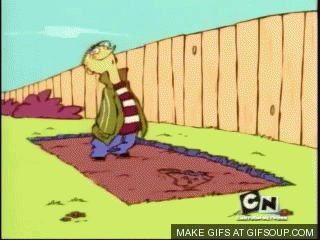

Ever been so stuck that you feel like banging your head against something repeatedly?

Everyone gets "stuck". You do. I do. My company's CEO does. Google's CEO does as well (probably).

Whether at home, work or in our relationships, such sticking points are quite common when trying to do something non-trivial.

However, it is the next step we take in those moments of "stickiness" that dictates whether we will be successful or not.

If in those moments you feel like responding with any of the following:

- Its not my fault!
- It John/Jamie/Jane/Jill's fault!
- I can't do anything about that!
- Oh my god I don't know what to do!
- This is just too hard for me..
- I should start with something easier..

...then you _need to_ watch the 3 minute clip below by <a href="http://videofruit.com/" target="_blank">Bryan Harris from Videofruit</a>, about what to do when you get stuck. Bryan teaches people how to grow their online business for a living so he knows a thing or two about overcoming barriers to success.

He can be a bit hard-hitting but I *insist* that if there is one thing you do today, then watching this clip should be it.

`video: https://www.youtube.com/embed/CPa3E8yis0I`

Simply put, when stuck, pause, take a deep breath and:

1. Understand where you are getting stuck.
2. Figure out a list of potential solutions.
3. Pick one solution and forget about the others.
4. Realise that you will hit roadblocks but your _only_ job is to keep moving ahead regardless.

And if you still end up getting stuck, then rinse and repeat till you get unstuck!

Remember:

> “If you can’t fly then run, if you can’t run then walk, if you can’t walk then crawl, but
> whatever you do you have to keep moving forward.”
>
> Martin Luther King, Jr.

**
Know someone else who can use a dose of inspiration? Then use the buttons below to share this around!
**
