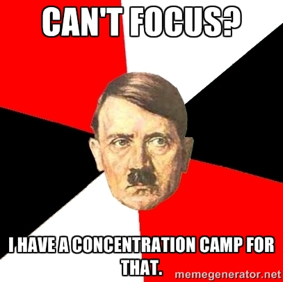
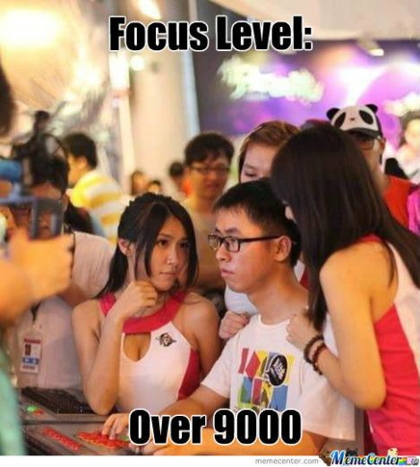

Can't focus? Got too much on your mind? Head buzzing with thoughts?

I know how you feel.

I am one of those overthinking types that get distracted super easily. In fact, there are times when I have SO much work to do yet I keep getting SO distracted/consumed by my bed, food, people, thoughts in my head and Vampire Diaries (don't judge). It almost feels like making it through one of Hitler's concentration camps would be easier than being able to focus on what I need to be doing.

Fortunately, over the past few months I have found a solution that works wonders by taking advantage of the "Cocktail Party Effect", allowing me to focus on demand and get s\*\*t done.

## The Cocktail Party Effect

> ...is the phenomenon of being able to focus one's auditory attention on a particular stimulus
> while filtering out a range of other stimuli, much the same way that a partygoer can focus on a
> single conversation in a noisy room.
>
> Wikipedia

While this effect is specific to the way we hear things, a similar effect can be recreated to make your brain focus on the one thing that you are meant to be working on (a.k.a. the single conversation) amidst all the other crap floating around in your head (a.k.a. the noisy room).

The solution for me came in the form of <a href="http://noisli.com" target="_blank">Noisli</a>.

As long as you have a pair of headphones and a device with an internet connection, you can head on over to <a href="http://noisli.com" target="_blank">http://noisli.com</a> and start playing your own set of ambient sounds - which are essentially background noises recorded in various _natural_ settings and scenarios.

My personal favourite is a combination of Rain, Coffee shop, Train and Thunder sounds, but feel free to experiment and see what allows you to work at your best.

Noisli works *really* well because when there is complete, total and utter silence (like at night), my brain feels so idle that it starts thinking of random things just to keep itself entertained - such as what am I going to have for dinner tonight or what is that spider doing climbing all over the little minion on my desk - which then leaves me struggling to carry on with the task at hand.

However, with ambient noise around, that idle part of my brain seems to get caught up in trying to ignore the noise, thus allowing the part of my brain that was actually being useful, to keep being useful and focus on the thing that matters - whatever I am working on.

The best thing about artificial ambient noise - the sort created by Noisli - is that, it works for me regardless of whether I am coding, writing a report at work or writing a blog post. Or regardless of whether it's too quiet around me or too loud (thank god for noise cancelling headphones!).

So once again, to reiterate:

1.  Go to <a href="http://noisli.com" target="_blank">noisli.com</a>.</li>
2.  Start up your favourite ambient sounds - mine are Rain, Thunder and Coffee shop.</li>
3.  Start working.

...and before you know it, you will be in "the zone" and focusing like your life depended on it (for hours).

