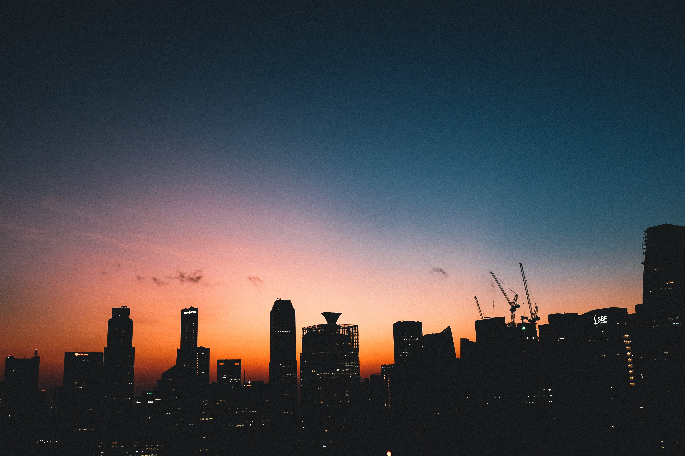
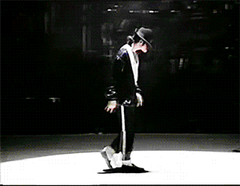

There is a popular saying that comes from the 19th century practice of American bars offering a "free lunch" - in order to get drinking (and paying) customers.

> There are ain't no such thing as a free lunch.

And guess what? Life works the same way.

You start putting in a lot of time at work and just as that starts paying off, you start to see your social life suffer. Or your health decides to go down the hill.

You start spending more time with your friends and end up - willingly or unwillingly - ignoring your family.

You try focusing on family and being mindful of your health and all of a sudden you start falling behind at work - watching in a daze as you see others swooping in to take _your_ opportunities.

That's just the underlying framework of life. You gotta give something to get something.

So then why is it that we're try so hard to resist that? Is it possible to constantly keep moving forward and keep doing well in _everything_? Or does it always have to be a case of two steps forward, one step back?

My personal experience has always been the latter. In fact, sometimes it has even ended up being one step forward, two steps back.

<small>End up feeling like MJ sometimes.</small>

I suspect part of the reason for this craving for all steps forward, all the time is the lack of a growth mindset plus a conditioning from an environment that leaves us craving for "success" - the event, instead of "success" - the journey.

> ...conditioning from an environment that leaves us craving for "success" - the event instead of "success" - the journey.

Being unable to step back and look at things in the long term is the third reason that rounds off the trio of things that leave us disappointed in ourselves. In the world. And in people around us.

Most of us feel like we're the only ones struggling with this forward-back back-forward dance of life.

The truth is that we are just very good at hiding the steps back while simultaneously highlighting the steps forward (it's called an Instagram page - look it up 🤪)

Fact of the matter is that life isn't going to change the way it operates itself so it's up to us to chase something that is unattainable in the short terms or go for the long play and make peace with the fact that sometimes you just have to take one step back for every two steps forward.
