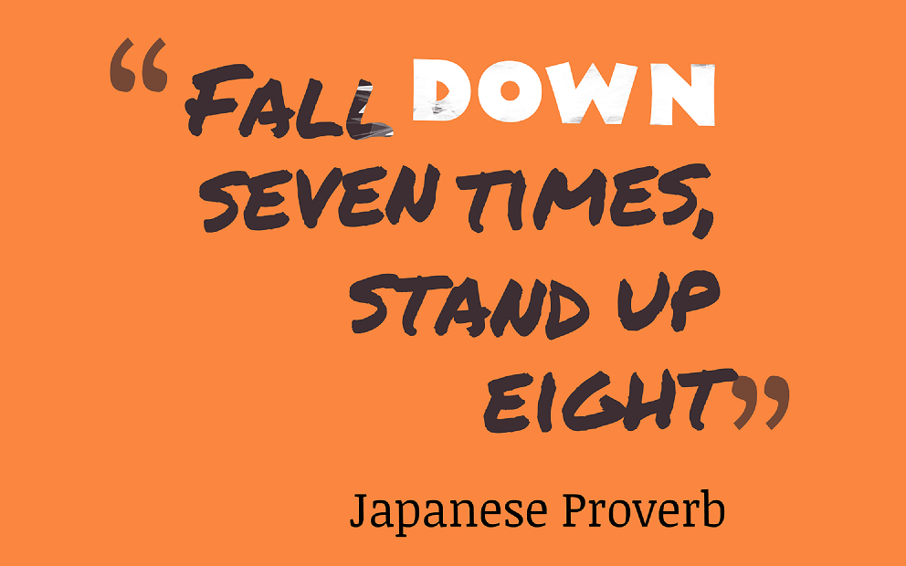

Positive attitude vs persistence - is there a difference? What is the difference? Is one better than the other? Are both useful? Where are they both useful? How can one cultivate one or the other? Can they be cultivated? What are some example situations? When does one prevail over the other one? Is there a difference between how this applies to individuals vs teams?

"Wtf is the difference?" - my initial reaction reading about this in <a href="https://www.goodreads.com/book/show/6963194-art-of-manipulation" target="_blank">Art of Manipulation by R. B. Sparkman</a>.

Persistence is the ability to keep going when the going gets tough. And, having a positive attitude will allow me to do that, right? Right?

    
    Well, yes, no, maybe!

### Yes

A positive attitude - or keeping your chin up - is having hope that things will eventually, hopefully, work out. And hope of a better future can certainly keep you going - which in essence is persistence - the ability to keep going.

So from that perspective a positive attitude _can_ help you be more persistent indeed.

### No

However, the problem is that when life decides to deliver a one-two combination right to your face, your positive attitude can quite abrupty decide to go on a vacation - without you.

    

At that point, if a positive attitude is all you had going for you, then it's lights out. It's a wrap. See ya later, alligator. Time to go home. Time to step aside and let someone else handle the jandal.

On the other hand, when you're persistent, you essentially go into situations with the mindset that if things haven't worked out then it's not the end. Plain and simple.

> If things haven't worked out, then it's not the end.
>
> Said every persistent person ever.

So while going into something you might feel like you're 🐟ed, and life is throwing everything but the kitchen sink at you, if you just manage to hang on, you just might end up on top - and that is what persistence is about.
Have a couple of gifs of a fighter getting tonked and then have a third gif with the fighter winning at the end. https://biteable.com/blog/tips/make-gif-video/

The ability to hang in there and not give up, while you're the anvil and then strike with full force when it's your turn to be the hammer - that's persistence.

### Maybe

Just like with most non-trivial things in life though, it's never quite that black and white. It always depends on the context. A positive attitude and persistence while being different, _can_ go hand in hand. _Sometimes_.

Style and substance. Butter and bread. Patrick and Spongebob. That's the relationship between positivity and persistence. They work best in conjunction and without one, the other is not quite as good. BUT theoretically, if you had to, you would choose substance, bread and Spongebob hands down right?

A positive group of people will attract more people but positivity is an emotion - a feeling - and just like most feelings it passes the moment our thoughts or our situation changes.

**What am I trying so say here? Maybe - not really - they aren't the same but they can go hand in hand quite well - like the examples I gave above. What's the takeaway? The takeaway is that there are situations where one is better to start things off than the other and they both can lead to the other.**

Think of positivity as style and persistence as substance. Style without substance can get you a fair amount of way but eventually you will get found out. Substance without style comes in handy when there is a real need for it but it's attractive. Noone wants to work with a grumpy but persistent person. They'd rather work with someone who is a little bit unsure about themselves but has an upbeat attitude.
A positive attitude can attract other people and it can enhance your persistence but without persistence - the substance, the real deal - positivity is just a hollow front that will get squashed the moment you meet real adversity.

For a long time I was someone who had tonnes of positivity but not a lot of persistence. Going into everything I would be upbeat and be making jokes and laughing. However, the moment things started turning south, I would be like oh well guess this just wasn't meant for me and give it up and start chasing the next shiny thing.

For a while that approach seemed like it was the way to go - because what else is there. However, over time I realized that I was pretty unhappy with myself for giving up so easily. But at least I had a positive attitude. The problem was that while people were impressed by how positive I was in all situations, it wasn't really helping my cause in getting me what I wanted. That's when I realized that while positivity was great for me as a marketing tool - people can sense positivity almost the moment they meet you. Persistence was the real core value that I needed to develop if I ever wanted to get anywhere that wasn't a walk in the park. Because obstacles are bound to come - so if you know that going in, why not just accept it as part of the journey and get rolling.

There are scenarios and situations where a positive attitude by itself can work wonders. Like with the well known fake it till you make it approach. You pretend like you know what you're doing and soon you really start to know what you're doing and then even if you don't know what you're doing or something goes wrong, you _know_ that you can push through and find out excatly what you need to do. In this instance, starting with a positive attitude and getting a few runs under your belt can actually give you the persistence that is the hallmark of winners.

Like the movie scenarios where a speech fires up a handful of soldiers, allowing them to beat a much biggera and sizeable army when they had no chance to begin with. Or, in team sports, where a positive attitude is an infectious thing that can influence others around you into being positive when the chips are down and vice versa - thus creating an atmosphere where the whole group becomes persistent as a result of the positive attitude.

But at an individual level, a positive attitude is actually worth a lot less. If you're just positive but not persistent, you're going to be 🐟ed at the first sign of trouble. You can't control everything that happens and if something does go wrong, or not according to the plan, your positivity will vanish and if that's all you were relying on to keep plugging away then you will give up. You will quit.

So end of the day while I would rather be just persistent than be just positive, in all honesty, I'd rather take a combination of both of them. A positive attitude that can attract others to my cause and make them want to work with me and an iron willed persistence that will allow me to plugging away when all the chips are down and out.
