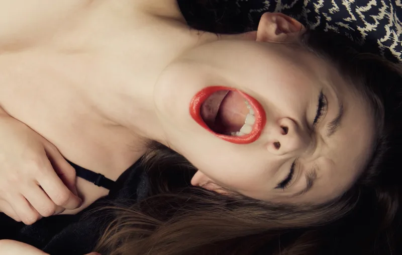
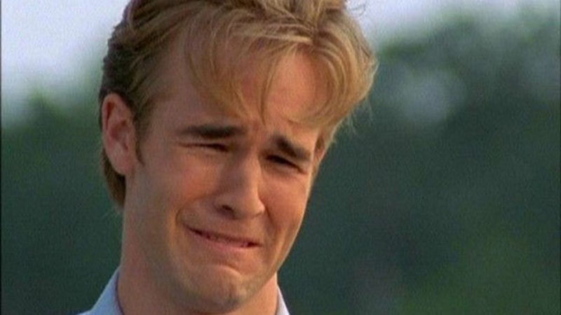

From a newborn to the President of the United States - we are either trying to avoid pain or gain pleasure.

Think about it - the pleasure of making more money, buying a better phone, traveling to new places, providing for your family, feeling successful. That's what a lot of us are working for.

The pain of not being able to pay your bills, being perceived as a failure, being mocked by your peers, feeling like a failure. These are the things that we work to avoid.

Everything we do is driven by pain or pleasure. That is the **Pain Pleasure principle**.

While your definition of what is painful or pleasurable might be different to mine, in the end, pleasure is what we both crave and pain is what we both want to avoid.

## The Negativity Bias

You were having a great day and suddenly something goes wrong and it all goes down the drain 😧

Sound familiar?

There is a reason for that. <a href="https://www.psychologytoday.com/au/articles/200306/our-brains-negative-bias" target="_blank">Studies</a> show that negative events have a much bigger impact on us than the positive ones.

The same thing applies with the Pain Pleasure principle.

**While we might work hard to gain pleasure, we will work _even_ harder to avoid pain.**

So you might go have an ice cream from time to time, but you will definitely turn up to a job that you hate, every morning because, the pain of being out of a job is much greater than the pleasure of eating something sweet.

## Control Your Pain & Pleasure

Have you ever tried to have a new years resolution and then have it fall apart by the time February is in sight?

That's because generally our resolutions either force us to do something painful (like exercise) or abstain from something pleasurable (like eating fries).

And the result is always the same. We resist while we have the willpower - but one bad day and it all comes tumbling down.

> Secret to success is learning how to use pain and pleasure, instead of having pain and pleasure use you.
>
> Anthony Robbins

Well, its not that simple.

Well, if we accept all this then that means that if we want to stop doing something or start doing something, we simply have to make the alternative seem more painful that what we want to do.

The sooner we can accept this, the sooner we can realize two things.

1. We can change our behavior armed with this knowledge.

2. We can manipulate others armed with this knowledge.

that if these two basic needs - avoiding pain, gaining pleasure - are what drive us, then manipulating ourselves into changing our behaviours is actually quite a manageable task.

How you ask?

Well you can try to stop eating those delicious fries - but if you still keep craving them, you will try to resist till your willpower holds up. Once it runs out though, you will end up right back where you started.

The same applies for things that are painful. We can force ourselves to do them once, twice, thrice... but if it keeps being painful then eventually we will have a bad day and just give up on it.

The key things to keep in mind are.

They drive us.

Either we're running towards something because its pleasurable.

Or, we're running away from something because its painful.

More often than not, its the latter (see negativity bias).

So what does that mean?

Well its simple. We can try to change our behaviour about something. But if we still get pleasure from the behaviour, we will resist till we run out of willpower and then end up right back where we started.

The same applies for something that seems painful. We might be able to force ourself to do it once, twice, thrice - but if it keeps being painful, eventually we will have a bad day and we will give up on it.
