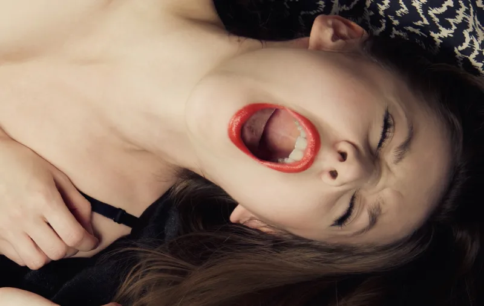

From a newborn to the President of the United States - we are either trying to avoid pain or gain pleasure.

Think about it - the pleasure of making more money, buying a better phone, traveling to new places, providing for your family, feeling successful. That's what a lot of us are working for.

The pain of not being able to pay your bills, having broken relationships, being mocked by your peers, feeling like a failure. These are the things that we work to avoid.

Everything we do is driven by pain or pleasure. That is the **Pain Pleasure principle**.

While your definition of what is painful or pleasurable might be different to mine, in the end, pleasure is what we both crave and pain is what we both want to avoid.

## The Negativity Bias

You were having a great day and suddenly something goes wrong and it all goes down the drain 😧

Sound familiar?

There is a reason for that. <a href="https://www.psychologytoday.com/au/articles/200306/our-brains-negative-bias" target="_blank">Studies</a> show that negative events have a much bigger impact on us than the positive ones.

The same thing applies with the Pain Pleasure principle.

**While we might work hard to gain pleasure, we will work _even_ harder to avoid pain.**

This is why we consistently turn up to a job we might not enjoy but struggle to make time to work on that startup or book or blog. Because, the pain of being deprived of everything job affords us is much greater than the pleasure of a successful startup/book/blog of our own.

## Control Your Pain & Pleasure

Have you ever tried to have a new years resolution and then have it fall apart by the time February is in sight?

That's because generally our resolutions either force us to do something painful (like exercise) or abstain from something pleasurable (like eating fries).

And the result is always the same. We resist while we have the willpower - but one bad day and it all comes tumbling down.

> Secret to success is learning how to use pain and pleasure, instead of having pain and pleasure use you.
>
> Anthony Robbins

To be continued...
